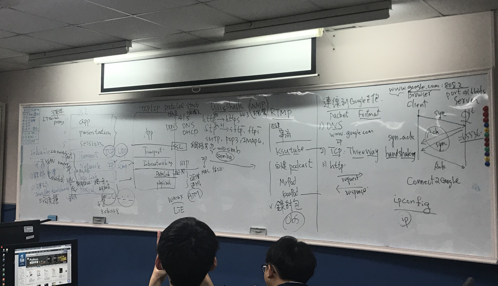

# 資訊工程導論

# 上課照片：


# 說明OSI Model與 TCP/IP Protocol
```
OSI Model：
開放式系統互聯模型（英語：Open System Interconnection Model，縮寫：OSI；簡稱為OSI模型）是一種概念模型，
由國際標準化組織提出，一個試圖使各種電腦在世界範圍內互連為網路的標準框架。
```
```
TCP/IP Protocol：
網際網路協議（英語：Internet Protocol Suite，縮寫IPS）是一個網路通訊模型，
以及一整個網路傳輸協定家族，為網際網路的基礎通訊架構。
它常被通稱為TCP/IP協定套組（英語：TCP/IP Protocol Suite，或TCP/IP Protocols），簡稱TCP/IP。
因為該協定家族的兩個核心協定：TCP（傳輸控制協定）和IP（網際網路協定），為該家族中最早通過的標準。

TCP/IP提供了點對點連結的機制，將資料應該如何封裝、定址、傳輸、路由以及在目的地如何接收，都加以標準化。
它將軟體通訊過程抽象化為四個抽象層，採取協定堆疊的方式，分別實作出不同通訊協定。
協定套組下的各種協定，依其功能不同，被分別歸屬到這四個階層之中，常被視為是簡化的七層OSI模型。

```
# 協定protocol
```
Q：何謂communication protocol[簡稱協定protocol]?
A：通信協定（英語：Communications Protocol，也稱傳輸協定）在電信領域中指的是，
   在任何物理媒介中允許兩個或多個在傳輸系統中的終端之間傳播資訊的系統標準，也是指電腦通信或網路裝置的共同語言。
   
Q：WHY Layering為何要分層?
A：OSI七層模型之所以要對網路分層，主要是在網路通訊的整個過程中，將整個流程細化開來，每一層完成各自的事情，互不干擾。
```
# 各種協定：
```
簡述下列協定protocol
須回答
(A)英文全名
(B)運作在那一層?
(C)主要功能
(D)相關工具或伺服器
```
# 網路硬體設備 Network Devices
```
簡述底下網路設備:須說明
(A)運作在OSI那一層?
(B)主要功能
```
```
(1) HUB  vs Repeater
(2) Switch vs Bridge
(3) Router
(4) L4 Switch
(5) Proxy 
```
